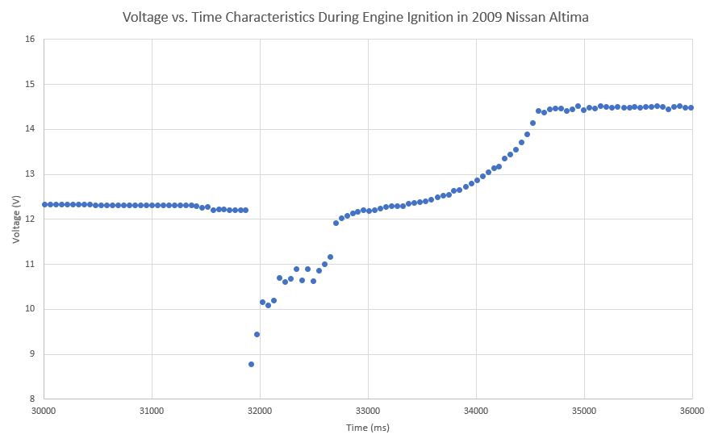
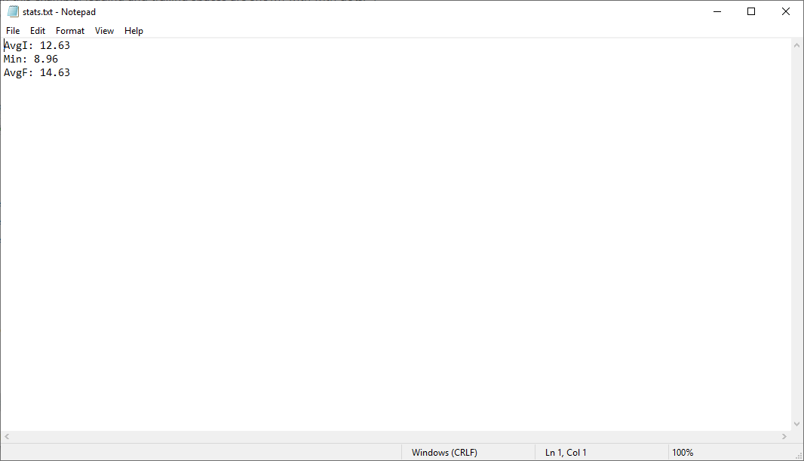
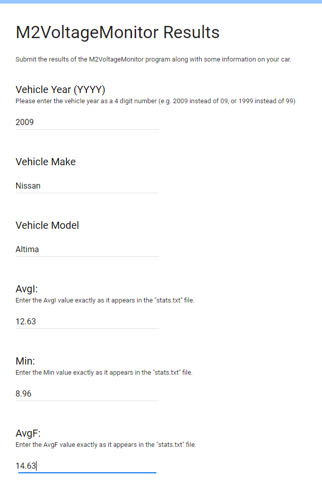
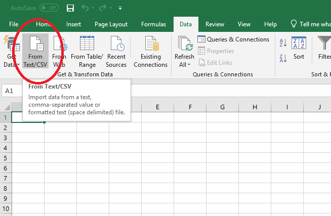
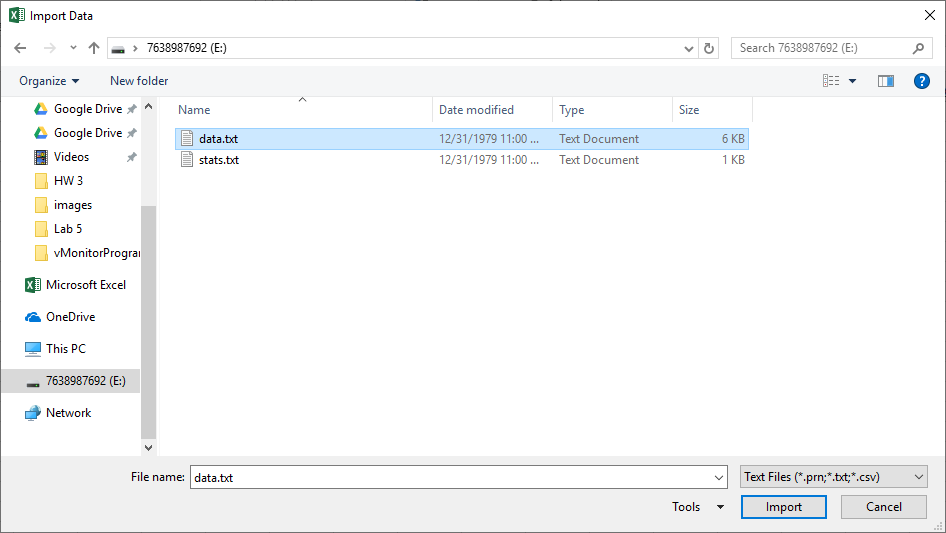
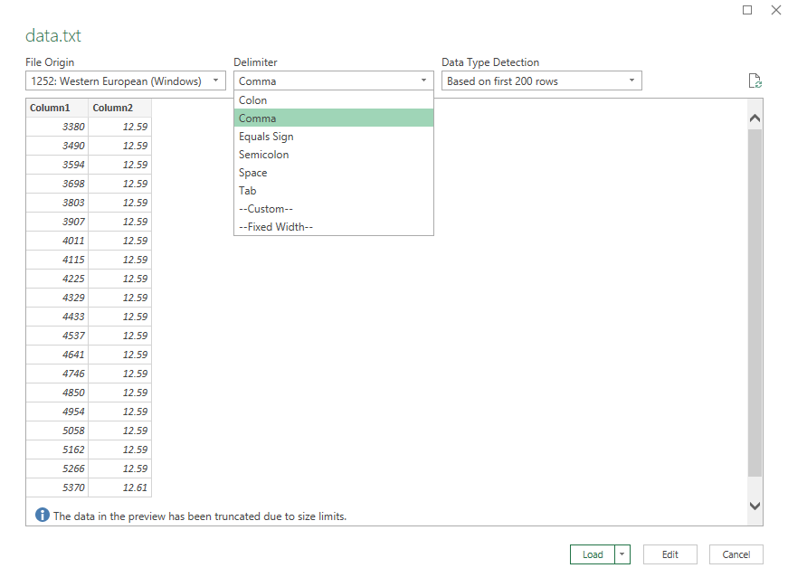
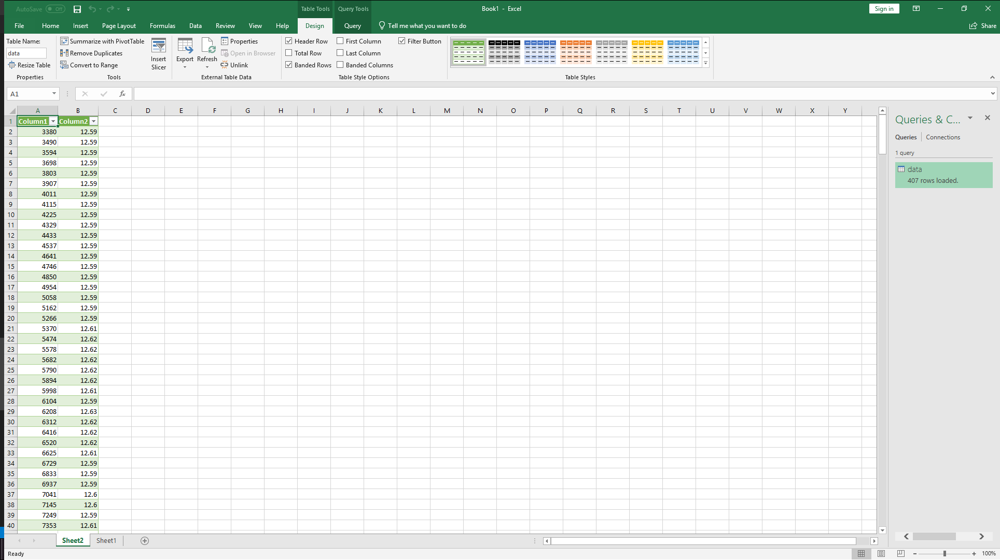
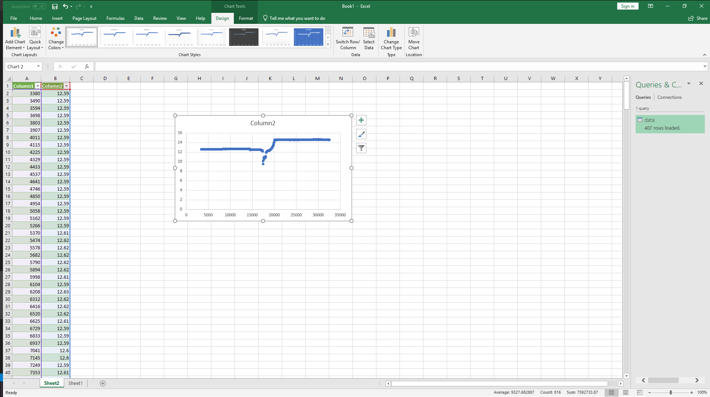

# M2VoltageMonitor - Help Us Collect Data!

## What data is collected?
The program will monitor the voltage of the vehicle during engine ignition along with immediately before and after. The results of the test are stored locally on the microSD card in two files called "data.txt" and "stats.txt"

### **"data.txt"**
This file stores the voltage (V) versus time (ms) data in a CSV format. None of the data in this file needs to be submitted, however if you're curious what the voltage response of the vehicle looks like during engine ignition (like the graph below) the data is formatted nicely to be able to import into a program like Microsoft Excel.

### **"stats.txt"**
This file stores the important data which we're interested in, the average initial voltage (AvgI), the minimum voltage (Min), and the average final voltage (AvgF).

  

## Why is this data useful?
Many people have done it before or known someone who's done it: leaving your headlights on and coming back to a dead battery. When developing electronic devices for cars a similar problem can occur with high power devices such as cellular modems. Therefore it would be advantageous to keep the high power devices off until the car is turned on, which raises the question, how can we tell when the car is turned on?

There are a multitude of ways to approach this problem, one possible solution is to monitor the voltage level of the vehicle and watch for the characteristics of engine ignition. See below:

In the graph above we can identify 3 distinct regions: 

1. Pre Engine Ignition (t<~32,000ms)

   During this period nothing very interesting is happening, the vehicle is just sitting and the battery is putting out a little over 12 volts. We'll call this the average initial voltage, or AvgI for short.

2. Engine Ignition and Alternator Spinup (~32,000ms<t<~34,500ms)

   When the key is turned (or the start button pushed) the starter motor begins turning over, dragging the vehicle voltage down to a minimum (Min) of about 9 volts. After the engine starts we can see the voltage begins climbing as the vehicle's alternator kicks in to recharge the battery.

3. Engine Idle (t>~34,500ms)

    At this point the vehicle is idling stably and the voltage is steady at about 14.5 volts, thanks to the alternator. We'll call this the average final voltage, or AvgF for short.

Assuming the voltage response observed here is reasonably indicative of the majority of cars, we can roughly define a single car's voltage response as a function of three values: the average initial voltage before startup, the minimum voltage during startup, and the average final voltage after startup (AvgI, Min, and AvgF, respectively).

  

## How to Run the Program and Collect Data
1. Upload the "M2VoltageMonitor.ino" sketch to the M2 and then remove from computer.
2. Format the microSD card as FAT32 and insert.
3. Confirm that the AC in the vehicle is turned off.
4. Without starting the car, insert the M2 into the OBDII port.
5. 1 red LED will light on the M2, it is now recording the initial battery voltage.
6. Press button 1, the red LED will turn off and then all LEDs will turn on, the M2 is now standing by for the car to start.
7. Start the car.
8. Press button 1, the LEDs will begin to turn off one at a time while the M2 records idle battery voltage.
9. Once all LEDs are off, data collection is done and the M2 can be removed.

   ### Running Multiple Tests
   1. After step 9 above, another test can be run without removing the M2 and the results will be appended to the ends of the "data.txt" and "stats.txt" files.
   2. Turn off the engine.
   3. Press and hold button 1 until the red LED begins flashing (~3 seconds).
   4. Release button 1 and wait for the red LED to change from flashing to solid (~10 seconds).
   5. Perform the test normally from step 5 of the original instructions.

  

## Submitting Test Data
1. The results of the test will be stored in the "stats.txt" file on the microSD card:

2. Submit the results, along with the year, make, and model of the vehicle [here](https://forms.gle/pqieTZP5j4ZiwYJZ8)
:
3. That's it! Thanks for your help!

  

## Visualizing the "data.txt" Data with Microsoft Excel

If you're curious what your own vehicle's voltage response looks like you can generate a graph very quicly and easily with the "data.txt" file and Microsoft Excel

1. In a new workbook, select the option to import data "From Text/CSV":

2. Select the "data.txt" file from the microSD card:

3. Select "Comma" for delimiter type:   
(Depending on your version of Excel this stage may look a little different, however just try adjusting the settings until the data forms two columns as shown below)

4. Press the "Load" button and the data should be added in a new sheet:

5. Select both columns A and B and then insert a scatter plot:
